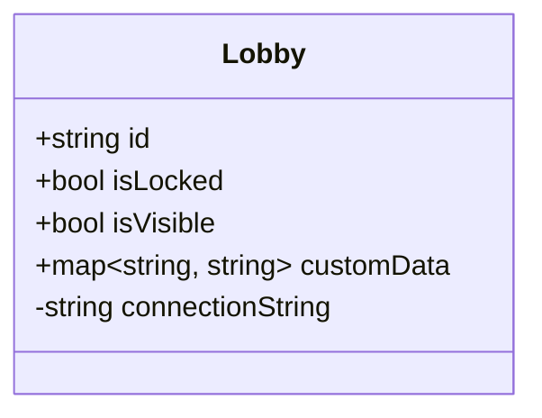

# mobhub

A lobby manager for multiplayer games.

## Proposals

This section contains proposals on what *mobhub* should be, and how to
implement it.

### Vision

*Mobhub* should be a simple to manage, self-hosted solution for managing player
lobbies and server lists for multiplayer games.

* Should be easy to integrate with Godot, but not exclusive to it
  * This includes other game engines, but also games built from scratch
* Should be easy to self-host
  * Easy to setup on a variety of setups, from a single VPS to large Kubernetes
    clusters
* Should be game-agnostic
  * Does not make assumptions about the game if not necessary
  * Does not prescribe what the user's game should be like
* Should be focused
  * Includes only the features needed to bring players together in lobbies

### Use cases

Some common usages for lobby services and how they relate to *mobhub*:

- Creating a lobby
  - Client connects to the service
  - Client requests a lobby, sending in initial data
  - Service creates a lobby and binds it to the client
  - Client receives lobby ID
- Listing lobbies
  - Client connects to the service
  - Client requests the list of lobbies
  - Service streams the lobbies in response
    - ❓Do we send only lobby IDs, or some data too? And if so, what data? Does
      the client specify that?
  - List is updated by streaming changes
  - Clients can terminate the updates by submitting a request
- Joining a lobby
  - Client submits a join request with the lobby's ID
  - Service responds with a connection string
  - Client parses the connection string and connects
  - Examples:
    - `enet://98.109.115.132:16384`
    - `noray://tomfol.io:8890/k394RbdoV-tvJorXyOIUE`
  - The address string is completely up to the game, though an URI-like syntax
    is recommended
- Displaying lobby name, player count, etc.
  - Lobbies only contain the necessary data by default ( id, visibility, is
    locked, etc. )
  - Owning clients can set custom data
  - Custom data is stored in a key-value map
  - Keys can be arbitrary, though we'll provide some standards for common stuff
  - Value is also arbitrary
  - Configurable limits apply ( e.g. max key length, max value length, max
    entry count, etc. )
- Managing a lobby
  - Lobby can only be managed by the client who created it
  - This is bound to the socket connection
  - Creating client can submit requests that update lobby data
  - Creating client can submit requests that manipulate the lobby ( e.g.
    delete, lock, make private, etc. )
  - Requests must include the lobby being managed ( e.g. by ID )
  - Requests trying to modify someone else's lobby are rejected
- Making a lobby hidden
  - Hidden lobbies can be joined by ID, but are not listed
  - Owning client can either create the lobby as hidden, or submit a request to
    hide the lobby
  - Same for making the lobby visible again
- Making a lobby private
  - Private lobbies are hidden, and usually only invited players can join
  - Owning client makes the lobby hidden
  - Whenever someone tries to connect, the game runs its own authentication
    - e.g. hosting game process distributes a special join key over a
      background service
  - This case is low-prio until there's some social service we can integrate
    with
- Locking a lobby
  - Locked lobbies are visible but can't be joined
  - For example the game is about to start after a countdown
  - During the countdown, we don't want to delete the lobby, but also don't
    want anyone to join
  - Owning client can submit a request to lock / unlock lobby
  - ❓ Is this really that common / necessary?

### Features

- Track lobbies
  - Define relevant interfaces ( e.g. Lobby )
  - Keep a list of lobbies in memory
  - Implement CRUD operations
  - No public API to implement at this point
- Create lobby flow
  - Create lobby with submitted custom data
  - Bind lobby ownership to creating client
  - Respond with lobby ID
- Lobby update operations
  - Set custom data keys - support updating multiple values at once
  - Set flags - is locked, is hidden
  - Delete lobby
- Lobby list
  - Expect a request
  - Reply with stream of current lobbies
  - ❓ Client submits list of custom data keys, response includes custom data
    per lobby
- Querying lobbies
  - Client submits a request, with lobby ID and optionally custom data keys
    needed
  - Service responds with base lobby data + custom values
  - Service responds with error if lobby doesn't exist
  - ❓ Should clients be able to query hidden lobbies if they have the ID
    already? 
- Lobby join
  - Reject if locked
  - Check if lobby ID valid
  - Respond with connection string
- Lobby list subscription
  - Clients receive list updates in real time
  - Lives in a separate module
  - Lobby module emits events - lobby created, deleted, hidden, showed, locked,
    unlocked
  - Client submits request for updates
  - Respond with stream
  - Client can submit request to stop updates
  - ❗ May overlap with existing list functionality
  - Optional: Buffer updates for some time / count before sending them
    - We could even consolidate the list
    - e.g. if a lobby is created and destroyed in the same batch, send 0 events
      instead of 2

Possibilities for the future:

- Store lobbies in DB
  - Motivation: keep the list of lobbies even if the service restarts
  - Idea: build a separate module that reads the list on startup, updates DB on
    lobby module events
- Ring layout
  - Motivation: a single instance may not be enough, run multiple and
    distribute the load
  - Problem: if an instance creates a lobby, the rest of the instances need to
    know
  - Idea: configure a list of other hosts, where we broadcast our lobby events
    - This allows for arbitrary layouts, e.g. ring, star, p2p, etc.
  - ❗ Make sure to not overwrite each other's changes when using a shared DB
  - ❗ Make sure to give each event an ID, so the same event isn't sent back
    and forth forever between two instances

### Authentication

TODO

### High level architecture

Similar to noray, the service will be structured as a thin outer shell ( config
parsing, app entry point ), wrapping multiple modules. Each module provides
certain functionality by hooking into the app's lifecycle. Modules may depend
on each other.

TODO: Some mermaid diagrams of the various components

### Data model

TODO: Some mermaid diagrams of what data is stored ( lobbies, participants, etc. )

### Tech stack

- TypeScript
- Bun
- [Trimsock]
- [pino] for logging
- [Prometheus] for metrics

[Trimsock]: https://github.com/foxssake/trimsock
[pino]: https://getpino.io/
[Prometheus]: https://prometheus.io/
